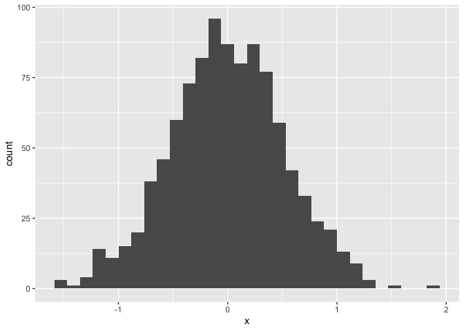
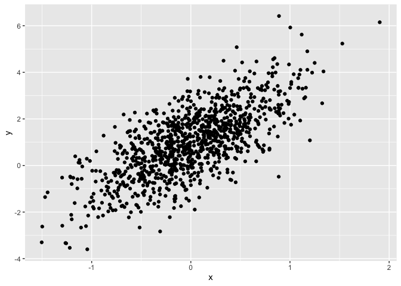

Building Blocks - Writing with Data
================
Juyoung(Rosemary) Hahm
2020-9-13

# Learning assessment 1:

Write a named code chunk that creates a dataframe comprised of: a
numeric variable containing a random sample of size 500 from a normal
variable with mean 1; a logical vector indicating whether each sampled
value is greater than zero; and a numeric vector containing the absolute
value of each element. Then, produce a histogram of the absolute value
variable just created. Add an inline summary giving the median value
rounded to two decimal places. What happens if you set eval = FALSE to
the code chunk? What about echo = FALSE?

``` r
sample_df = tibble(
  sample_num = rnorm(500, mean = 1),
  sample_zero = sample_num > 0,
  sample_abs = abs(sample_num)
) 
ggplot(sample_df, aes(x = sample_abs)) + geom_histogram()
```

<!-- -->

``` r
sample_medianline = median(pull(sample_df, sample_num))
```

The median of the variable containing absolute values is 1.

# Learning assessment 2:

After the previous code chunk, write a bullet list given the mean,
median, and standard deviation of the original random sample.

  - Mean of the sample is 1.0168609.
  - Median of the sample is 1.0014259.
  - Standard deviation of the sample is 0.9786468.

# Summary

First we create a dataframe containing variables of four different
types.

``` r
example_df = tibble(
  vec_numeric = 5:8,
  vec_char = c("My", "name", "is", "Rosemary"),
  vec_logical = c(T,T,T,F),
  vec_factor = factor(c("male", "male", "female", "female"))
)
```

The variable `vec_numeric` has class integer, and the variable
`vec_factor`has class factor.

Next, we show the plots of a data frame `plot_df`.

``` r
set.seed(1) 
plot_df = tibble(
  x = rnorm(1000, sd = 0.5),
  y = 1 + 2*x + rnorm(1000),
)
```

The histogram of `plot_df` is:

``` r
ggplot(plot_df, aes(x = x)) + geom_histogram()
```

<!-- -->

Next, the scatter plot of `y` vs `x` is:

``` r
ggplot(plot_df, aes(x = x, y = y)) + geom_point()
```

<!-- -->

git remote -v
